#  InfiniBench: A Benchmark for Large Multi-Modal Models in Long-Form Movies and TV Shows

<font size=3><div align='center' > [[ Project Page](https://vision-cair.github.io/InfiniBench/)] [[📝 arXiv Paper](https://arxiv.org/abs/2406.19875)] [[🤗 Download](https://huggingface.co/datasets/Vision-CAIR/InfiniBench/tree/main)] [[🏆Leaderboard](https://huggingface.co/datasets/Vision-CAIR/InfiniBench/tree/main)]</div></font>
## 🔥 News
- **[2025-06-10]** This is a new released version of Infinibench.
#   Overview:
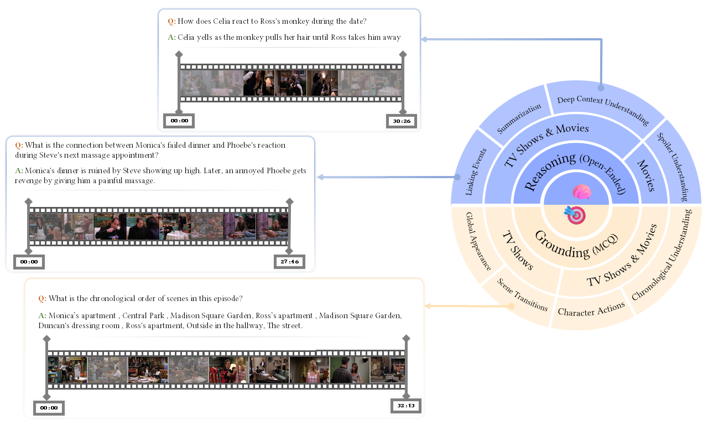
<strong>InfiniBench skill set comprising eight skills. The right side represents skill categories and question types, while the left side provides examples of both multiple-choice (MCQ) and open-ended questions.</strong>

Understanding long-form videos, such as movies and TV episodes ranging from tens of minutes to two hours, remains a major challenge for multi-modal models. Existing benchmarks often fall short in testing the full range of cognitive skills needed to process these temporally rich and narratively complex inputs. We introduce InfiniBench, a comprehensive benchmark designed to rigorously evaluate the capabilities of models in long video understanding.
InfiniBench offers:
**(1) Over 1,000 hours of video content, with an average video length of 52.59 minutes,(2) The largest set of question-answer pairs for long video comprehension, totaling around 91 K, (3) Eight diverse skills that span both grounding-based (e.g., scene transitions, character actions) and reasoning-based (e.g., deep context, multi-event linking) understanding, and (4) Rich annotation formats, including both multiple-choice and open-ended questions.**
We conduct an in-depth evaluation across both commercial (GPT-4o, Gemini 1.5 Flash) and open-source (Qwen2.5-VL, InternVL2.5) vision-language models. 
Results reveal that current models remain far from solving long video understanding: on grounding-based skills, the top open-source model (Qwen2.5-VL) and GPT-4o achieve only 39.4\% and 48.1\% accuracy, respectively. 
Interestingly, several models achieve non-trivial performance using only the movie or episode title, without watching the video, revealing a reliance on pre-trained world knowledge that partially compensates for the absence of visual or temporal understanding.
These findings highlight critical gaps in current approaches and underscore the need for models that truly engage with long visual narratives.

# 🏆 Infinibench Leaderboard (test verified):
<table style="font-size: 11px;">
  <thead>
    <tr>
      <th rowspan="2">Models</th>
      <th rowspan="2">Frame Rate</th>
      <th colspan="4" style="text-align:center; background-color:#E4EAFF">Grounding Skills</th>
      <th colspan="4" style="text-align:center; background-color:#FFF2CC;">Reasoning Skills</th>
      <th rowspan="2" style="background-color:#E4EAFF;">Avg. Acc (0-100)</th>
      <th rowspan="2" style="background-color:#FFF2CC;">Avg. Score (0-10)</th>
    </tr>
    <tr>
      <th>Global Appearance</th>
      <th>Scene Transitions</th>
      <th>Character Actions</th>
      <th>Chronological Understanding</th>
      <th>Summarization</th>
      <th>Deep Context Understanding</th>
      <th>Spoiler Understanding</th>
      <th>Linking Events</th>
    </tr>
  </thead>
  <tbody>
    <tr style="background-color:#92a2fc;"><td>Baseline Random</td><td>--</td><td>19.96</td><td>19.77</td><td>18.41</td><td>36.45</td><td>--</td><td>--</td><td>--</td><td>--</td><td>23.65</td><td>--</td></tr>
    <tr><td>GPT-4o</td><td>450</td><td></td><td></td><td></td><td></td><td></td><td></td><td></td><td></td><td></td><td></td></tr>
    <tr><td>Gemini Flash 2.0</td><td>1 FPS</td><td></td><td></td><td></td><td></td><td></td><td></td><td></td><td></td><td></td><td></td></tr>
    <tr><td>Qwen2.5VL</td><td>768</td><td>33.16</td><td>29.85</td><td>29.31</td><td>45.37</td><td>3.34</td><td>4.82</td><td>3.67</td><td>6.39</td><td>34.42</td><td>4.56</td></tr>
    <tr><td>Qwen2VL</td><td>768</td><td>25.79</td><td>31.02</td><td>35.91</td><td>43.07</td><td>2.25</td><td>4.90</td><td>3.29</td><td>6.01</td><td>33.95</td><td>4.11</td></tr>
    <tr><td>Intern VL 3.0</td><td>128</td><td>35.73</td><td>29.64</td><td>24.96</td><td>43.73</td><td>3.92</td><td>4.13</td><td>3.63</td><td>6.17</td><td>33.52</td><td>4.46</td></tr>
    <tr><td>Video-Flash</td><td>1000</td><td>22.01</td><td>30.81</td><td>37.67</td><td>47.58</td><td>2.70</td><td>3.87</td><td>2.95</td><td>5.02</td><td>34.52</td><td>3.64</td></tr>
    <tr><td>LongVU</td><td>1 FPS</td><td></td><td></td><td></td><td></td><td></td><td></td><td></td><td></td><td></td><td></td></tr>
    <tr><td>LLava-Onevision</td><td>128</td><td>24.19</td><td>27.83</td><td>25.26</td><td>46.50</td><td>2.00</td><td>4.09</td><td>3.31</td><td>6.14</td><td>30.95</td><td>3.89</td></tr>
    <tr><td>InternLM-XComposer</td><td>16 FPW</td><td>23.27</td><td>29.53</td><td>29.99</td><td>42.78</td><td>1.67</td><td>2.84</td><td>2.46</td><td>5.00</td><td>31.39</td><td>2.99</td></tr>
    <tr><td>InternVL2.5</td><td>128</td><td>29.05</td><td>26.65</td><td>23.99</td><td>36.26</td><td>2.51</td><td>3.14</td><td>2.32</td><td>5.06</td><td>28.99</td><td>3.26</td></tr>
    <tr><td>InternVL2</td><td>128</td><td>27.44</td><td>25.48</td><td>23.76</td><td>40.93</td><td>2.81</td><td>3.77</td><td>3.08</td><td>5.93</td><td>29.40</td><td>3.90</td></tr>
    <tr><td>Goldfish (Mistral)</td><td>60 FPW</td><td>17.55</td><td>23.67</td><td>23.99</td><td>39.37</td><td>3.00</td><td>5.42</td><td>3.69</td><td>6.45</td><td>26.15</td><td>4.64</td></tr>
    <tr><td>MiniGPT4-video (Mistral)</td><td>60</td><td>18.49</td><td>25.16</td><td>28.49</td><td>41.06</td><td>2.81</td><td>3.11</td><td>3.08</td><td>3.87</td><td>28.30</td><td>3.22</td></tr>
    
  </tbody>
</table>
<p><strong>InfiniBench leaderboard</strong> across eight skills. FPV (Frames Per Video), FPS (Frames Per Second), and FPW (Frames Per Window) are reported. All models in this evaluation utilize <strong>subtitles</strong>.</p>

# 📊Benchmark statistics:
### Skills statistics:
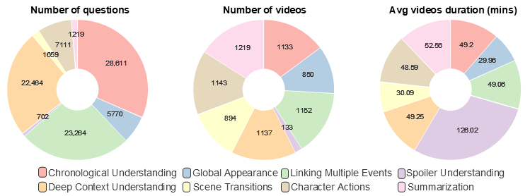<br>
<strong>InfiniBench skills statistics. (A) Number of questions per skill, (B) Number of videos per skill, and (C) Average video duration per skill</strong>

### Videos source statistics:
<!-- make the image 80 % -->
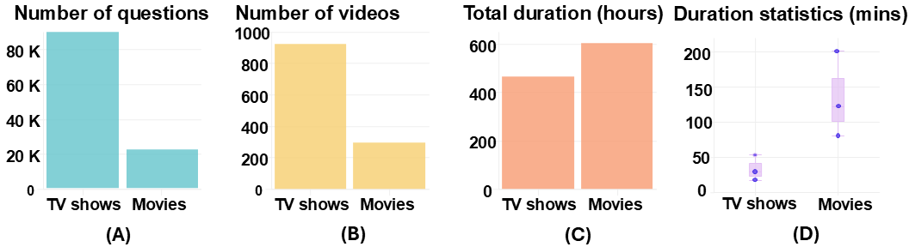<br> 
<!--  <br> -->
<strong>Comparison between TV shows and Movies. (A) shows the number of questions, (B) represents the number of videos, (C) represents the Total video durations, and (D) shows The Minimum, Maximum, and average video duration for each video source</strong>


# ⬇️ Download The Benchmark
We are only provide annotations for already extisting videos datasets, namely [TVQA](https://nlp.cs.unc.edu/data/jielei/tvqa/tvqa_public_html/download_tvqa.html) and [MovieNet](https://movienet.github.io/).<br>
We only preprocess the videos and subtitles for these datasets as mentioned in the paper to allign with the benchmark requirements. <br>
To make it easier to use the benchmark, we have preprocessed the videos and subtitles for both TVQA and MovieNet datasets and you can directly download the preprocessed version from the table below. <br>
| Split                | Download link                                                                                   |
| -------------------- | ----------------------------------------------------------------------------------------------- |
| Test (verified)      | [Videos + Annotations](https://huggingface.co/datasets/Vision-CAIR/InfiniBench/tree/main/test)  |
| Train (not verified) | [Videos + Annotations](https://huggingface.co/datasets/Vision-CAIR/InfiniBench/tree/main/train) |

**OR** <br>

You can download the original data and preprocess it using the scripts provided in this repository<br>
View [Videos preprocessing](data_genration/README.md)
## 💡 Benchmark Examples

<p align="center">
    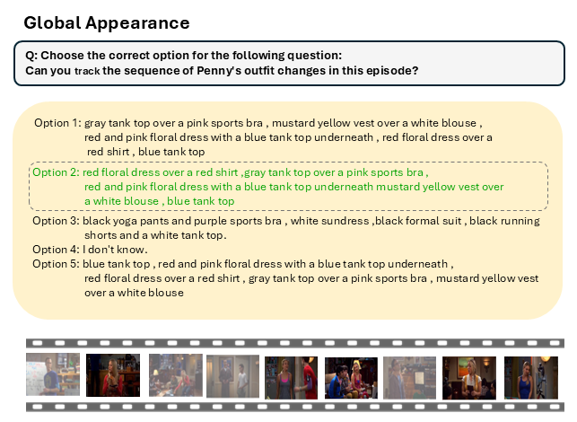
</p>

<div align='center' >
<details>
<summary> Click to expand more examples</summary>
<p align="center">
    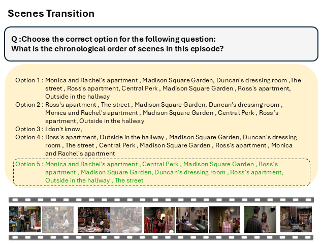
    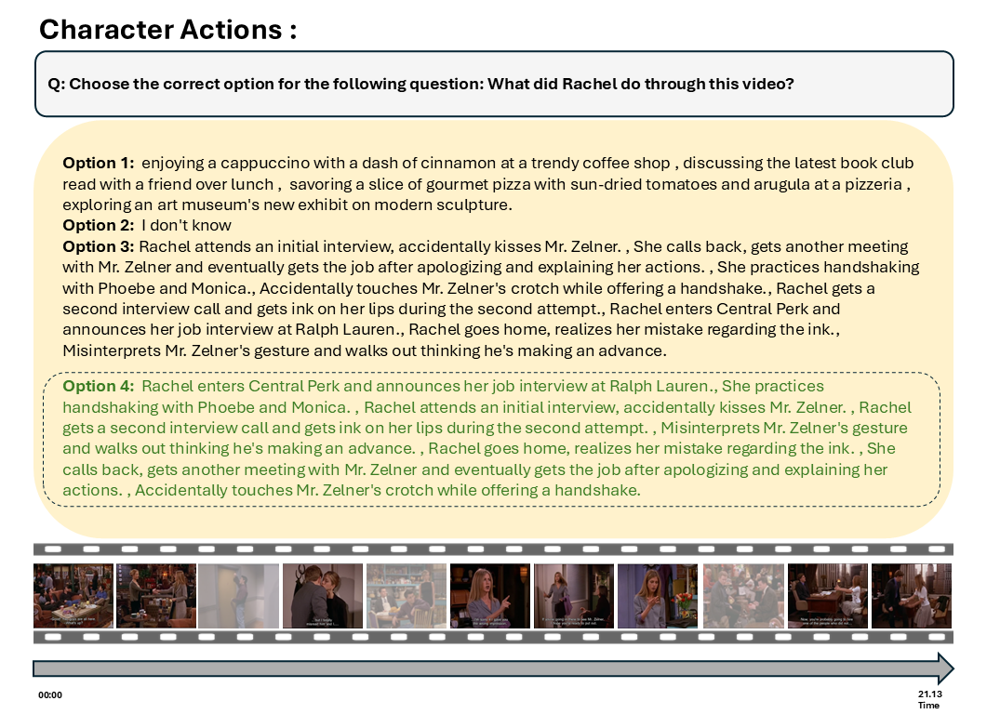
    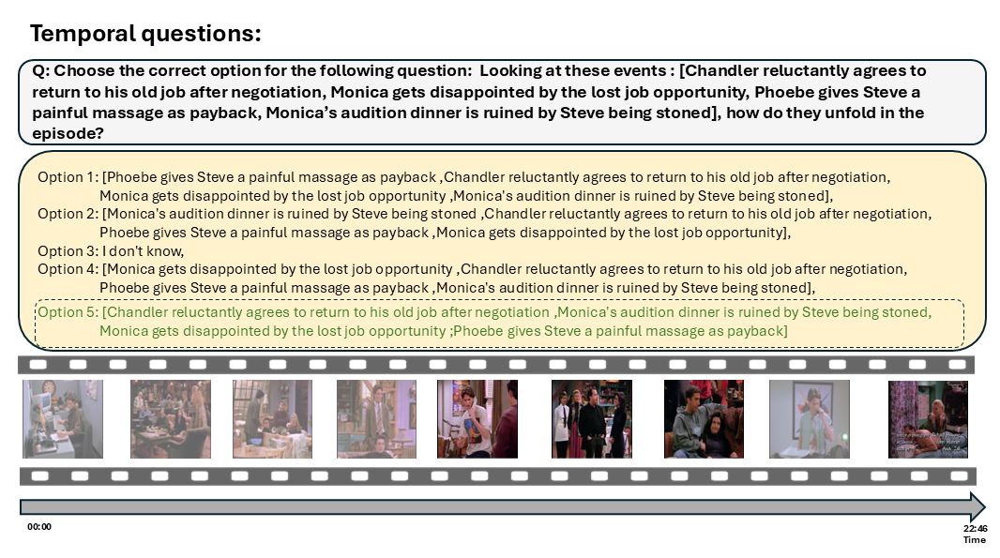
    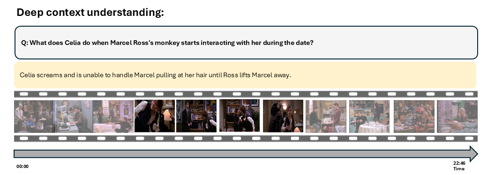
    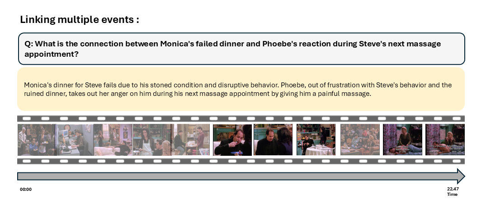
    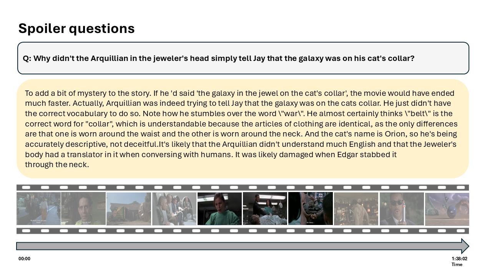
    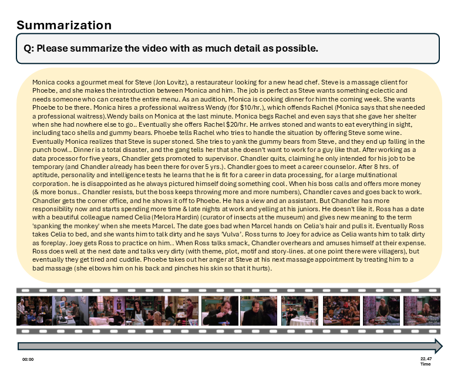
</details>
</div>

## Benchmark annotations pipeline
View the [data_genration/README.md](data_genration/README.md) for the full annotation pipeline details <br>

# Citation
If you're using InfiniBench in your research or applications, please cite using this BibTeX:
```
@misc{ataallah2024infinibenchcomprehensivebenchmarklarge,
      title={InfiniBench: A Comprehensive Benchmark for Large Multimodal Models in Very Long Video Understanding}, 
      author={Kirolos Ataallah and Chenhui Gou and Eslam Abdelrahman and Khushbu Pahwa and Jian Ding and Mohamed Elhoseiny},
      year={2024},
      eprint={2406.19875},
      archivePrefix={arXiv},
      primaryClass={cs.CV},
      url={https://arxiv.org/abs/2406.19875}, 
}
```

# License
This repository is under [BSD 3-Clause License](LICENSE.md).