#  InfiniBench: A Benchmark for Large Multi-Modal Models in Long-Form Movies and TV Shows

<font size=3><div align='center' > [[ Project Page](https://vision-cair.github.io/Infinibench/)] [[📝 arXiv Paper](https://arxiv.org/abs/2406.19875)] [[🤗 Download](https://huggingface.co/datasets/Vision-CAIR/InfiniBench/tree/main)] [[🏆Leaderboard](https://vision-cair.github.io/Infinibench/leaderboard.html)]</div></font>
## 🔥 News
- **[2025-08-14]** 🏆 **[2025 ICCV CLVL - Long Video Understanding Challenge (InfiniBench)](https://www.codabench.org/competitions/10065/)** is now live! Submit your predictions for test set evaluation.
- **[2025-06-10]** This is a new released version of Infinibench.
#   Overview:
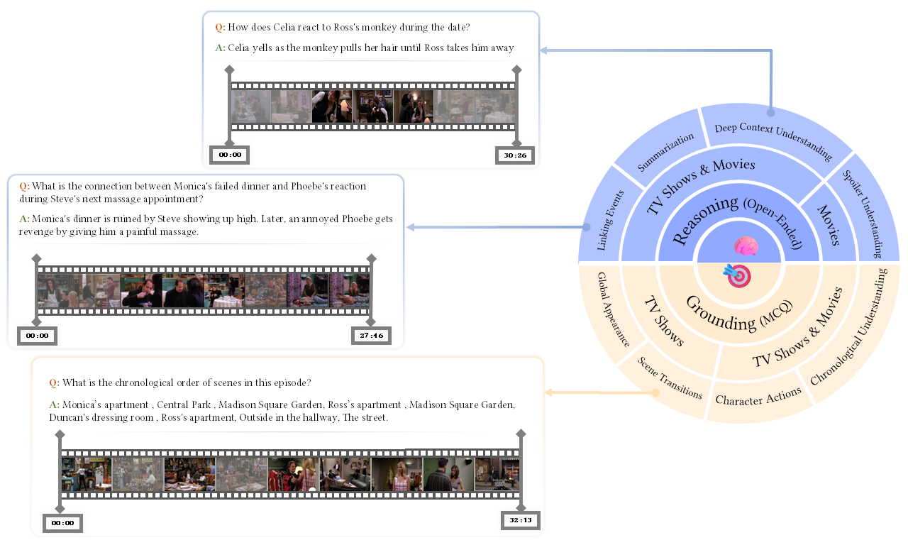
<strong>InfiniBench skill set comprising eight skills. The right side represents skill categories and question types, while the left side provides examples of both multiple-choice (MCQ) and open-ended questions.</strong>

Understanding long-form videos, such as movies and TV episodes ranging from tens of minutes to two hours, remains a significant challenge for multi-modal models. Existing benchmarks often fail to test the full range of cognitive skills needed to process these temporally rich and narratively complex inputs. Therefore, we introduce InfiniBench, a comprehensive benchmark designed to evaluate the capabilities of models in long video understanding rigorously. InfiniBench offers:(1) Over 1,000 hours of video content, with an average video length of 53 minutes. (2) The largest set of question-answer pairs for long video comprehension, totaling around 91 K. (3) Eight diverse skills that span both grounding-based (e.g., scene transitions, character actions) and reasoning-based (e.g., deep context understanding, multi-event linking). (4) Rich annotation formats, including both multiple-choice and open-ended questions. We conducted an in-depth evaluation across both commercial (GPT-4o, Gemini 2.0 Flash) and most recent open-source vision-language models such as (Qwen2.5-VL, InternVL3.0). Results reveal that:(1) Models struggle across the board: Even the best model, GPT-4o, achieves only 47.1 % on grounding-based skills, with most models performing near or just above random chance. (2) Strong reliance on world knowledge: Models achieve surprisingly high scores using only metadata (e.g., video titles), highlighting a tendency to rely on pre-trained knowledge rather than actual visual or temporal understanding. (3) Multi-Modal Importance: When provided with full video and subtitle context, however, models show substantial improvements, confirming the critical role of multimodal input in video understanding.

# 🏆 Infinibench Leaderboard (test verified):
<table style="font-size: 11px;">
  <thead>
    <tr>
      <th rowspan="2">Models</th>
      <th rowspan="2">Frame Rate</th>
      <th colspan="4" style="text-align:center; background-color:#E4EAFF">Grounding Skills</th>
      <th colspan="4" style="text-align:center; background-color:#FFF2CC;">Reasoning Skills</th>
      <th rowspan="2" style="background-color:#E4EAFF;">Avg. Acc (0-100)</th>
      <th rowspan="2" style="background-color:#FFF2CC;">Avg. Score (0-10)</th>
      <th rowspan="2" style="background-color:#FFF2CC;">Overall (0-100)</th>
    </tr>
    <tr>
      <th>Global Appearance</th>
      <th>Scene Transitions</th>
      <th>Character Actions</th>
      <th>Chronological Understanding</th>
      <th>Summarization</th>
      <th>Deep Context Understanding</th>
      <th>Spoiler Understanding</th>
      <th>Linking Events</th>
    </tr>
  </thead>
  <tbody>
    <tr style="background-color:#92a2fc;">
      <td>Baseline Random</td><td>--</td>
      <td>20.00</td><td>20.02</td><td>20.12</td><td>20.33</td>
      <td>--</td><td>--</td><td>--</td><td>--</td>
      <td>20.12</td><td>--</td><td>--</td>
    </tr>
    <tr>
      <td>GPT-4o</td><td>450 FPV</td>
      <td>49.67</td><td>37.71</td><td>39.93</td><td>60.98</td>
      <td>6.27</td><td>6.38</td><td>6.59</td><td>6.76</td>
      <td>47.07</td><td>6.50</td><td>56.04</td>
    </tr>
    <tr>
      <td>Gemini Flash 2.0</td><td>1 FPS</td>
      <td>45.11</td><td>39.31</td><td>50.00</td><td>50.10</td>
      <td>5.71</td><td>6.00</td><td>4.35</td><td>5.40</td>
      <td>46.13</td><td>5.37</td><td>49.89</td>
    </tr>
    <tr>
      <td>Intern VL 3.0</td><td>128 FPV</td>
      <td>34.30</td><td>27.76</td><td>20.49</td><td>31.12</td>
      <td>3.83</td><td>3.73</td><td>3.31</td><td>5.26</td>
      <td>28.42</td><td>4.03</td><td>34.37</td>
    </tr>
    <tr>
      <td>Qwen2.5VL</td><td>768 FPV</td>
      <td>30.03</td><td>25.28</td><td>22.74</td><td>20.35</td>
      <td>3.30</td><td>4.29</td><td>3.39</td><td>5.41</td>
      <td>24.60</td><td>4.10</td><td>32.79</td>
    </tr>
    <tr>
      <td>Qwen2VL</td><td>768 FPV</td>
      <td>23.54</td><td>28.18</td><td>30.21</td><td>27.40</td>
      <td>2.23</td><td>4.29</td><td>3.55</td><td>5.01</td>
      <td>27.33</td><td>3.77</td><td>32.52</td>
    </tr>
    <tr>
      <td>Goldfish (Mistral)</td><td>60 FPW</td>
      <td>16.20</td><td>22.93</td><td>21.35</td><td>25.44</td>
      <td>2.98</td><td>4.89</td><td>3.39</td><td>5.65</td>
      <td>21.48</td><td>4.23</td><td>31.88</td>
    </tr>
    <tr>
      <td>Video-Flash</td><td>1000 FPV</td>
      <td>20.52</td><td>29.56</td><td>34.90</td><td>37.38</td>
      <td>2.64</td><td>3.45</td><td>2.20</td><td>4.23</td>
      <td>30.59</td><td>3.13</td><td>30.95</td>
    </tr>
    <tr>
      <td>InternVL2</td><td>128 FPV</td>
      <td>26.62</td><td>24.86</td><td>21.53</td><td>26.61</td>
      <td>2.88</td><td>3.47</td><td>3.02</td><td>4.97</td>
      <td>24.91</td><td>3.59</td><td>30.38</td>
    </tr>
    <tr>
      <td>LLava-Onevision</td><td>128 FPV</td>
      <td>21.05</td><td>24.72</td><td>23.26</td><td>30.33</td>
      <td>2.03</td><td>3.75</td><td>2.69</td><td>5.10</td>
      <td>24.84</td><td>3.39</td><td>29.38</td>
    </tr>
    <tr>
      <td>InternVL2.5</td><td>128 FPV</td>
      <td>27.08</td><td>25.14</td><td>21.18</td><td>29.16</td>
      <td>2.45</td><td>2.83</td><td>2.14</td><td>4.22</td>
      <td>25.64</td><td>2.91</td><td>27.37</td>
    </tr>
    <tr>
      <td>InternLM-XComposer</td><td>16 FPW</td>
      <td>20.13</td><td>27.90</td><td>26.56</td><td>26.42</td>
      <td>1.62</td><td>2.59</td><td>2.25</td><td>4.04</td>
      <td>25.25</td><td>2.63</td><td>25.75</td>
    </tr>
    <tr>
      <td>LongVU</td><td>512 FPV</td>
      <td>27.67</td><td>20.99</td><td>27.95</td><td>18.98</td>
      <td>1.68</td><td>2.90</td><td>2.76</td><td>3.58</td>
      <td>23.90</td><td>2.73</td><td>25.60</td>
    </tr>
    <tr>
      <td>MiniGPT4-video (Mistral)</td><td>60 FPV</td>
      <td>18.16</td><td>23.07</td><td>25.87</td><td>23.09</td>
      <td>2.04</td><td>2.86</td><td>2.04</td><td>3.33</td>
      <td>22.55</td><td>2.57</td><td>24.11</td>
    </tr>
    
  </tbody>
</table>

<p><strong>InfiniBench leaderboard</strong> across eight skills. FPV (Frames Per Video), FPS (Frames Per Second), and FPW (Frames Per Window) are reported. All models in this evaluation utilize <strong>subtitles</strong>.</p>

# 📊Benchmark statistics:
### Skills statistics:
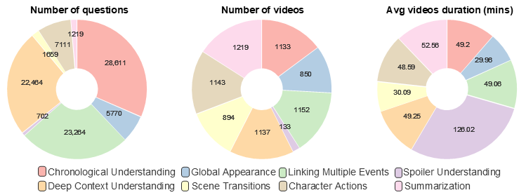<br>
<strong>InfiniBench skills statistics. (A) Number of questions per skill, (B) Number of videos per skill, and (C) Average video duration per skill</strong>

### Videos source statistics:
<!-- make the image 80 % -->
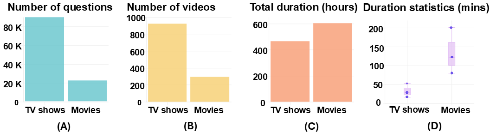<br> 
<!--  <br> -->
<strong>Comparison between TV shows and Movies. (A) shows the number of questions, (B) represents the number of videos, (C) represents the Total video durations, and (D) shows The Minimum, Maximum, and average video duration for each video source</strong>


# ⬇️ Download The Benchmark
We are only provide annotations for already extisting videos datasets, namely [TVQA](https://nlp.cs.unc.edu/data/jielei/tvqa/tvqa_public_html/download_tvqa.html) and [MovieNet](https://movienet.github.io/).<br>
We only preprocess the videos and subtitles for these datasets as mentioned in the paper to allign with the benchmark requirements. <br>
To make it easier to use the benchmark, we have preprocessed the videos and subtitles for both TVQA and MovieNet datasets and you can directly download the preprocessed version from the table below. <br>
| Split                | Download link                                                                                   |
| -------------------- | ----------------------------------------------------------------------------------------------- |
| Test (verified)      | [Videos + Annotations](https://huggingface.co/datasets/Vision-CAIR/InfiniBench/tree/main/test)  |
| Validation (verified) | [Videos + Annotations](https://huggingface.co/datasets/Vision-CAIR/InfiniBench/tree/main/validation) |
| Train   | [Videos + Annotations](https://huggingface.co/datasets/Vision-CAIR/InfiniBench/tree/main/train) |

**OR** <br>

You can download the original data and preprocess it using the scripts provided in this repository<br>
View [Videos preprocessing](data_genration/README.md)

# 🏆 Evaluation

## Test Set Evaluation

Submit your predictions to the [2025 ICCV CLVL - Long Video Understanding Challenge (InfiniBench)](https://www.codabench.org/competitions/10065/). The evaluation will be performed automatically on the Codabench platform. Please follow the guidelines provided in the challenge description.

## Validation Set Evaluation

Follow the instructions below to run the evaluation script locally in the [evaluation](evaluation/) directory.

> **Note:** Test set ground truth is not publicly available. Evaluation is based on the predictions you provide during challenge submission. Ensure your predictions follow the correct format as specified in the challenge guidelines.

## 💡 Benchmark Examples

<p align="center">
    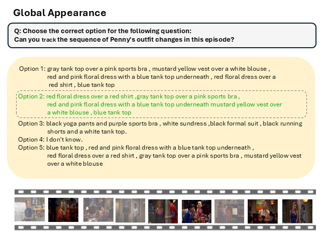
</p>

<div align='center' >
<details>
<summary> Click to expand more examples</summary>
<p align="center">
    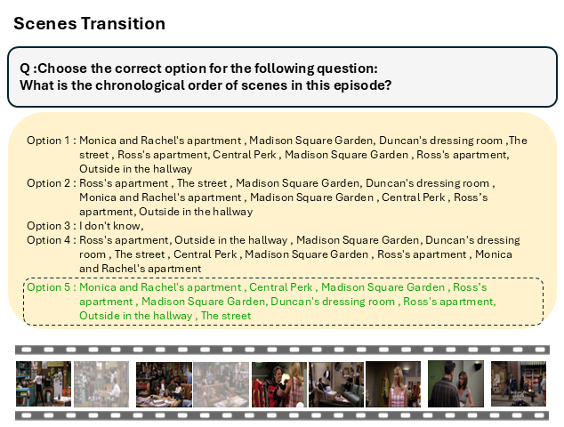
    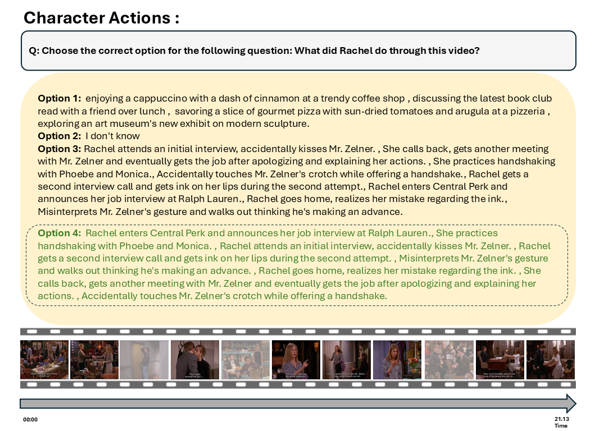
    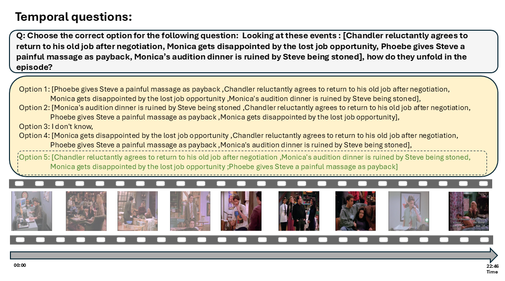
    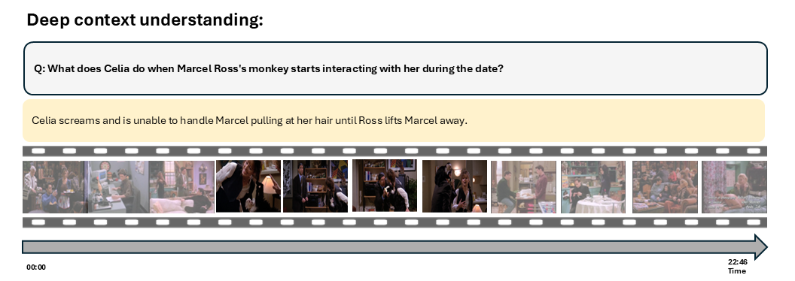
    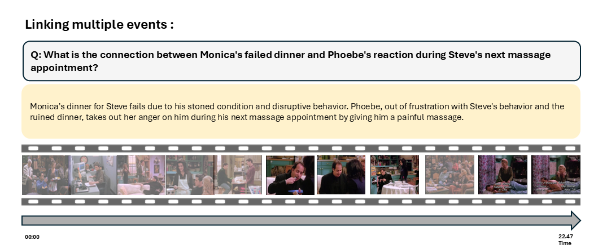
    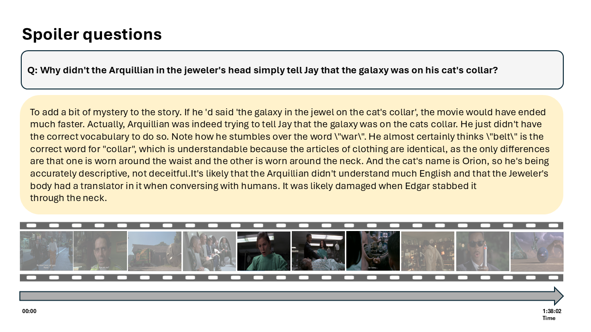
    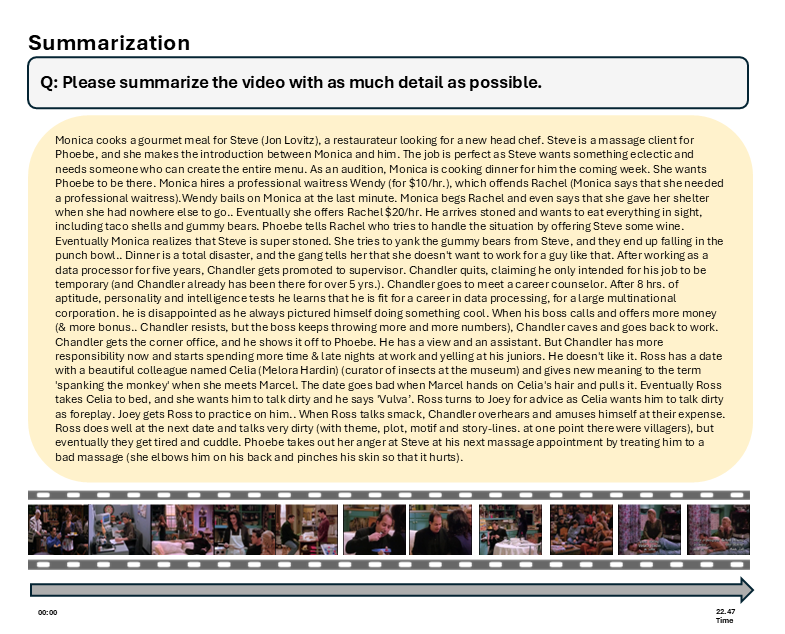
</details>
</div>

## Benchmark annotations pipeline
View the [data_genration/README.md](data_genration/README.md) for the full annotation pipeline details <br>

# Citation
If you're using InfiniBench in your research or applications, please cite using this BibTeX:
```
@misc{ataallah2024infinibenchcomprehensivebenchmarklarge,
      title={InfiniBench: A Comprehensive Benchmark for Large Multimodal Models in Very Long Video Understanding}, 
      author={Kirolos Ataallah and Chenhui Gou and Eslam Abdelrahman and Khushbu Pahwa and Jian Ding and Mohamed Elhoseiny},
      year={2024},
      eprint={2406.19875},
      archivePrefix={arXiv},
      primaryClass={cs.CV},
      url={https://arxiv.org/abs/2406.19875}, 
}
```

# License
This repository is under [BSD 3-Clause License](LICENSE.md).